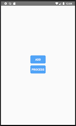

[](https://app.circleci.com/pipelines/github/technogise/rn-background-queue-processor)
[](https://coveralls.io/github/technogise/rn-background-queue-processor?branch=https%3A//github.com/technogise/rn-background-queue-processor.git)

# React Native Queue Processor

A package with the help of which users will be able to add and process different kind of jobs in separate queues.

## Prerequisite

This package does not have any prerequisites that need to be installed.

## Features

- A React Native Queue Processor with non persistent queues( persistent queues coming up in next release). 
- Jobs will be executed using the queues. 
- Has functionality for Worker instances as well. 
- It also plays well with Workers so your jobs can be thrown on the queue, then processed in dedicated worker threads for improved processing performance.

## Compatibility

While we ensure to keep the library updated with newer and improved upcoming releases for React Native, our current version works well for `React Native: v0.61.5`

## Installation steps

`npm i @technogise/rn-background-queue-processor`

## Usage

- [ExampleJob.js](examples/rnqpSample/app/service/ExampleJob.js):


```
export default class ExampleJob extends Job {
  execute(
    successCallback1 = data => {
      this.jobSuccess(data);
    },
    failCallback1 = data => {
      this.jobFail(data);
    },
  ) {
    const {url} = this.job.param;
    fetch(url)
      .then(response => {
        return response.json();
      })
      .then(data => {
        successCallback1(data);
      })
      .catch(error => {
        failCallback1(error);
      });
  }

  jobSuccess(data) {
    console.log('job success', this.job.name, this.job.id, 'response', data);
  }

  jobFail(data) {
    console.log('job Fail', this.job.name, this.job.id, data, 'response', data);
  }
}

```
      
  The `ExampleJob` class is developer defined class which extends Job and has user defined `execute`, `jobSuccess` and `jobFail`.
      
- [MainScreen.js](examples/rnqpSample/app/screens/MainScreen.js):


```
onAdd() {
  const jobToBeCreated = {
    name: 'testJob',
    param: {
      url: 'http://dummy.restapiexample.com/api/v1/employees',
    },
  };
  const job = new ExampleJob(jobToBeCreated);
  this.queue.enqueue(job);
}
```
  To add a job in the queue

```
onProcess() {
  worker.addQueue(queue);
  worker.process();
}

```

  To add the queue and process them using worker class instance 
   
 - [Queue](src/Queue.js)
    
```
constructor(dbAdapter) {
         this.adapter = dbAdapter;
     }
```
   The dbAdapter here is an additional feature with which we enable our developers to use this queue with any db of their choice.
   
   - `enqueue(job)`: Enqueues the job in the queue
   - `dequeue()`: Dequeues the job from queue on successful execution 
   - `peek()`: To get the top job from Queue
   - `getSize()`: Returns the length of Queue
   - `getItems()`: Gives all items of Queue
   
 - [Adapter](src/DbAdapter/Adapter.js)
 
    It is an abstract class which needs to be implemented by users of this package for easy use of any database for storing and processing the queues.
    
    For the easier understanding and reference, we have added an `InMemoryAdapter.js`. Here is a list of all functions available in the Adapter class which can be used,
   
   - `getAllItems()`: To get all jobs in current queue
   - `remove()`: Method to remove a job from current queue 
   - `addItem(item)`: Method to add a job in the current queue
   - `getLength()`: Method to get length of current queue
   - `getTopItem()`: Method to get the current job for processing
   
 - [Job](src/Job.js)
    While Job class has methods to get id, name and param of current job, we have made the `execute`, `jobSuccess` and `jobFail` function to be abstract for the developer so that he/she decides what to do on execute call.
   
    The `execute` method can be used for performing the action in current job. For example, if the current job is an API call then developer can add the steps to fetch data from API in this `execute` ,method.
   
    The `jobSuccess` method tells the developer defined action that needs to be taken if the API response is 200.
   
    The `jobFail` method tells the developer defined action that needs to be taken if the API response is 4XX.

 - [Worker](src/Worker.js)
 
    Worker class is a singleton class. In this class, user can add multiple queues using `addQueue(queue)` and process queues using `process()` 


### Upcoming in Next Release:

In the next version of React Native Queue Processor, we plan to add following features:

- Background Persistent queue processing 
- Retry job on fail
- Multiple queues for different kind of jobs like separate for API calls, separate for File uploading, separate for Emails, etc. 
- Examples showing database integration with other databases like Realm

 
Made with :heart: from [Technogise](https://technogise.com/)

You can explore our other works on [GitHub](https://github.com/technogise/)
